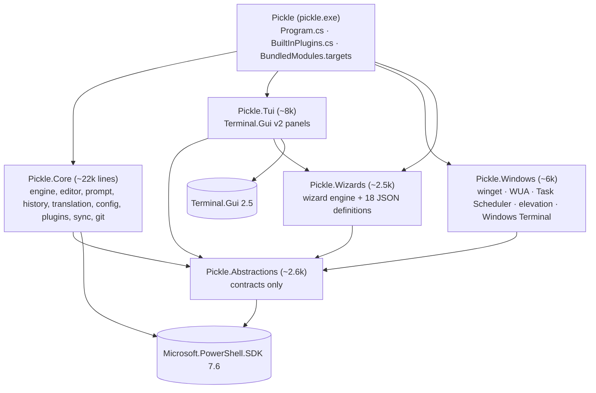
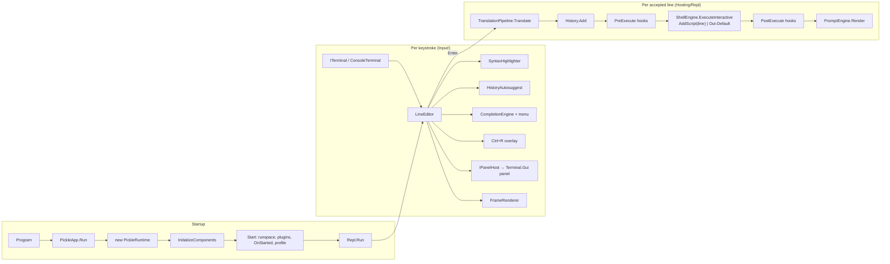
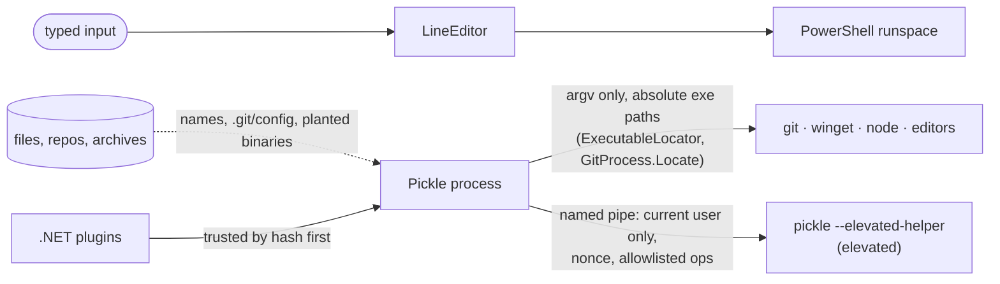

# Pickle architecture

A map of the repository for people and agents. `CLAUDE.md` has the rules and commands; this page shows how the
pieces connect. Line counts are approximate (non-test C# only).

## Projects

Plugins (built-in or third-party) see only `Pickle.Abstractions`. The executable is the only project that
references everything. It hands the built-in plugins to the runtime in load order (`BuiltInPlugins.cs`).

## Inside the process

- **ShellEngine** owns the main runspace (`_mainLock`) and a small runspace pool for `ShellTarget.Background`.
  A call from inside a running pipeline runs nested; any other call waits until the shell is idle.
  Panels requested while a pipeline runs are queued (`OpenPanelWhenIdle`) and opened at the next prompt.
- **PickleRuntime** is the composition root and implements `IPickleContext`. Components receive it and fetch
  collaborators lazily. Components that implement `IRuntimeComponent` get `Initialize()` (register actions, commands and segments) and
  `OnStarted()` (the runspace is open).
- All terminal I/O goes through `ITerminal`. Tests swap in `VirtualTerminal`, an ANSI interpreter with a cell grid.

## Feature → code

| Feature | Where |
|---|---|
| Line editor, key bindings, undo, selection, clipboard | `Core/Input/` (`LineEditor*.cs`, `DefaultKeyBindings.cs`) |
| Syntax highlighting | `Core/Syntax/` (PowerShell tokenizer → theme styles, `CommandCache`) |
| Autosuggest, fuzzy history, Ctrl+R | `Core/History/`, `Abstractions/Fuzzy.cs` (shared `FuzzyMatcher`) |
| Tab completion + menu | `Core/Completion/` |
| Prompt, themes, `$PSStyle` | `Core/Prompt/` (segments in `Segments/`), `themes/*.json` |
| Aliases | `Core/Aliases/` (`aliases.json` → PowerShell functions), `Cmdlets/AliasCmdlets.cs` |
| Linux syntax | `Core/Translation/` (rewriters + `Modules/Pickle.Translate` shims + command-not-found) |
| Config, schema, `pk config` | `Core/Config/`, `Abstractions/Config.cs`, `Config/Schemas/config.schema.json` |
| Plugins (PowerShell + .NET) | `Core/Plugins/`, `Cmdlets/PluginCmdlets.cs`, fixtures in `tests/fixtures/` |
| Sync | `Core/Sync/` (folder and git backends) |
| Profiles, PSReadLine shim | `Core/Profile/`, `Core/Modules/PSReadLine/` |
| `pk` dispatcher | `Core/Commands/`, `Cmdlets/InvokePickleCommandCmdlet.cs` |
| Panels | `Tui/Panels/<Feature>/` (Palette, Files, Settings, Jobs, Git, Windows, Wizard, ListPanel) |
| Git | `Core/Git/` (`GitService` over the git CLI) + `Tui/Panels/Git/` |
| Processes, network, disks (Alt+P/N/D, `pk top/net/disks`) | `Core/System/` (monitors: `/proc` on Linux, Process API + Win32 on Windows, disk usage scanner) + `Tui/Panels/System/` |
| winget, Windows Update, Task Scheduler | `Windows/Winget/`, `Windows/WindowsUpdate/`, `Windows/TaskScheduler/`, `Windows/Commands/` |
| Elevation | `Windows/Elevation/` (named-pipe broker, `--elevated-helper`, allowlisted operations) |
| Windows Terminal profile | `Windows/Terminal/` (fragment, `pk terminal`, `--write-terminal-fragment`) |
| Command wizards | `Wizards/` (engine, parser, `Definitions/*.json`) + `Tui/Panels/Wizard/` |
| Packaging | `packaging/` (WiX MSI, winget/Scoop manifests), `.github/workflows/`, `scripts/publish.sh` |

## Trust boundaries

- Values go to PowerShell as parameters. When generated script text has to embed a value, it goes through
  `PowerShellText.SingleQuote`, which also escapes the typographic quotes ‘ ’ ‚ ‛.
- Programs are never started by bare name, because Windows and .NET would look in the current directory first.
- The prompt runs `git status` wherever you `cd`. `GitService` turns off `core.fsmonitor` and repo-local filter commands,
  and diffs use `--no-textconv`/`--no-ext-diff`.
- The elevated helper validates every request again and runs only winget from WindowsApps, PowerShell from
  System32, WUA COM, or Task Scheduler.

## Tests

| Project | Covers |
|---|---|
| `tests/Pickle.Testing` | `TestPickle` (isolated runtime), `VirtualTerminal`, `Snapshot`, fakes for every Windows service |
| `tests/Pickle.Core.Tests` | engine, editor snapshots, history, completion, prompt/themes, translation shims, plugins, sync, git |
| `tests/Pickle.Tui.Tests` | panels headless (`TuiHarness.InitApp()`: virtual time, ANSI driver, 80×25) |
| `tests/Pickle.Windows.Tests` | parsers, elevation protocol/session, commands on fakes; real-system tests on Windows only |
| `tests/Pickle.Wizards.Tests` | every definition's presets and parse-back round trips |
| `tests/Pickle.E2E` | real pty + pyte: prompt, highlighting, translation, panels, vim round trip |
