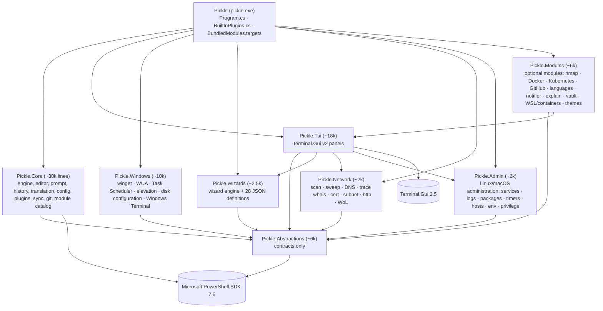
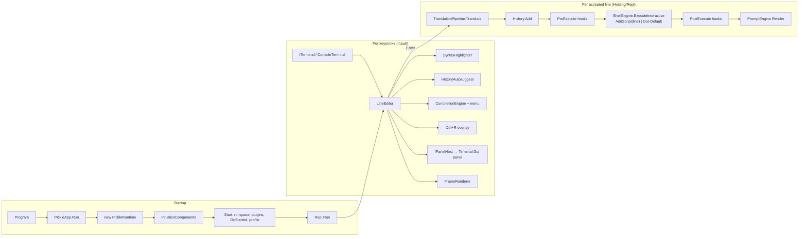
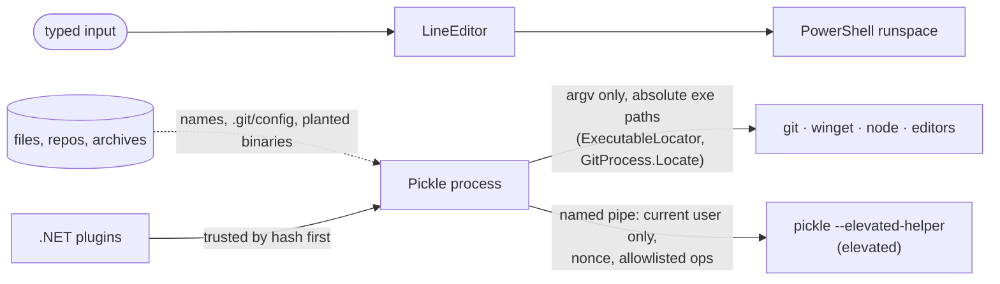

# Pickle architecture

A map of the repository for people and agents. `CLAUDE.md` has the rules and commands; this page shows how the
pieces connect. Line counts are approximate (non-test C# only).

## Projects

```mermaid
graph TD
    exe["Pickle (pickle.exe)<br/>Program.cs · BuiltInPlugins.cs · BundledModules.targets"]
    core["Pickle.Core (~30k lines)<br/>engine, editor, prompt, history, translation, config, plugins, sync, git, module catalog"]
    tui["Pickle.Tui (~18k)<br/>Terminal.Gui v2 panels"]
    win["Pickle.Windows (~10k)<br/>winget · WUA · Task Scheduler · elevation · disk configuration · Windows Terminal"]
    adm["Pickle.Admin (~2k)<br/>Linux/macOS administration: services · logs · packages · timers · hosts · env · privilege"]
    mods["Pickle.Modules (~6k)<br/>optional modules: nmap · Docker · Kubernetes · GitHub · languages · notifier · explain · vault · WSL/containers · themes"]
    wiz["Pickle.Wizards (~2.5k)<br/>wizard engine + 28 JSON definitions"]
    net["Pickle.Network (~2k)<br/>scan · sweep · DNS · trace · whois · cert · subnet · http · WoL"]
    abs["Pickle.Abstractions (~6k)<br/>contracts only"]
    sdk[("Microsoft.PowerShell.SDK 7.6")]
    tg[("Terminal.Gui 2.5")]

    exe --> core & tui & win & wiz & net & adm & mods
    core --> abs
    tui --> abs & wiz & net & adm
    mods --> abs & tui
    adm --> abs
    net --> abs
    win --> abs
    wiz --> abs
    abs --> sdk
    core --> sdk
    tui --> tg
```

Plugins (built-in or third-party) see only `Pickle.Abstractions`. The executable is the only project that
references everything. It hands the built-in plugins to the runtime in load order (`BuiltInPlugins.cs`), plus the
list of optional modules (`OptionalModules.All`): a module's `Create` runs only when it was selected, so an
unselected module costs nothing at startup ([modules.md](modules.md)).

## Inside the process

```mermaid
graph LR
    subgraph Startup
        P[Program] --> A[PickleApp.Run] --> R[new PickleRuntime]
        R --> I[InitializeComponents] --> S[Start: runspace, plugins, OnStarted, profile] --> L[Repl.Run]
    end

    subgraph "Per keystroke (Input/)"
        T[ITerminal / ConsoleTerminal] --> LE[LineEditor]
        LE --> HL[SyntaxHighlighter]
        LE --> AS[HistoryAutosuggest]
        LE --> CM[CompletionEngine + menu]
        LE --> OV[Ctrl+R overlay]
        LE --> PH[IPanelHost → Terminal.Gui panel]
        LE --> FR[FrameRenderer]
    end

    subgraph "Per accepted line (Hosting/Repl)"
        TR[TranslationPipeline.Translate] --> H[History.Add] --> PRE[PreExecute hooks]
        PRE --> EX["ShellEngine.ExecuteInteractive<br/>AddScript(line) | Out-Default"] --> POST[PostExecute hooks] --> PR[PromptEngine.Render]
    end

    L --> LE
    LE -- Enter --> TR
```

- **ShellEngine** owns the main runspace (`_mainLock`) and a small runspace pool for `ShellTarget.Background`.
  A call from inside a running pipeline runs nested; any other call waits until the shell is idle.
  Panels requested while a pipeline runs are queued (`OpenPanelWhenIdle`) and opened at the next prompt.
- **PickleRuntime** is the composition root and implements `IPickleContext`. Components receive it and fetch
  collaborators lazily. Components that implement `IRuntimeComponent` get `Initialize()` (register actions, commands and segments) and
  `OnStarted()` (the runspace is open).
- All terminal I/O goes through `ITerminal`. Tests swap in `VirtualTerminal`, an ANSI interpreter with a cell grid.

## Feature → code

| Feature | Where |
|---|---|
| Line editor, key bindings, undo, selection, clipboard | `Core/Input/` (`LineEditor*.cs`, `DefaultKeyBindings.cs`) |
| Syntax highlighting | `Core/Syntax/` (PowerShell tokenizer → theme styles, `CommandCache`) |
| Autosuggest, fuzzy history, Ctrl+R | `Core/History/`, `Abstractions/Fuzzy.cs` (shared `FuzzyMatcher`) |
| Tab completion + menu | `Core/Completion/` |
| Prompt, themes, `$PSStyle` | `Core/Prompt/` (segments in `Segments/`), `themes/*.json`; animation frames in `ThemeAnimator` (redrawn from the line editor's idle loop), light/dark in `SystemAppearance`, `pk theme import` in `ThemeImport` + `Abstractions/Services/TerminalSchemes.cs` (Windows Terminal schemes: `Windows/Terminal/WindowsTerminalSchemes.cs`). Guide: [themes.md](themes.md) |
| Theme gallery (Alt+E, `pk theme gallery`) | `Tui/Panels/Themes/` (previews via `IThemePreviewer`, drawn by `Tui/Widgets/AnsiView.cs`) |
| SSH hosts (Alt+H, `pk ssh`) | `Tui/Panels/Ssh/` (`SshHosts` reads ~/.ssh/config with Include, and known_hosts) |
| `pk version check/update` | `Core/Update/SelfUpdater.cs` (GitHub latest release, SHA256SUMS check, portable swap or MSI) |
| Startup timings (`pk doctor --startup`) | `Core/Hosting/StartupTimings.cs` |
| Background jobs in the first instance, shared cache, banner notices | `Core/Hosting/BackgroundWork.cs` (`IBackgroundWork`, primary.lock), `StartupNotices.cs`, `Core/Update/UpdateCheck.cs`; winget job in `Windows/WindowsPlugin.cs` |
| Run-as-administrator offer after access-denied failures | `Core/Hosting/ElevationOffer.cs` (from `Repl.ExecuteLine`, through the `sudo` rewriter) |
| Panel input fixes: paste, click focus, mouse wheel, frame rate | `Tui/FocusSync.cs`, `Tui/WheelScroll.cs`, `Tui/PasteRepaint.cs`, `Tui/FramePacing.cs` (attached by `PanelHost`); bracketed paste at the prompt in `Core/Input/LineEditor.cs` |
| `pk bugreport` | `Core/Commands/BugReportCommand.cs` (report, redacted config and logs in a zip) |
| Tab/taskbar progress, long-command bell | `Core/Hosting/TabProgress.cs` (OSC 9;4 from the REPL and `ProgressPane`) |
| Aliases | `Core/Aliases/` (`aliases.json` → PowerShell functions), `Cmdlets/AliasCmdlets.cs` |
| Linux syntax | `Core/Translation/` (rewriters + `Modules/Pickle.Translate` shims + command-not-found) |
| Config, schema, `pk config` | `Core/Config/`, `Abstractions/Config.cs`, `Config/Schemas/config.schema.json` |
| Plugins (PowerShell + .NET) | `Core/Plugins/`, `Cmdlets/PluginCmdlets.cs`, fixtures in `tests/fixtures/` |
| Sync | `Core/Sync/` (folder and git backends) |
| Profiles, PSReadLine shim | `Core/Profile/`, `Core/Modules/PSReadLine/` |
| `pk` dispatcher | `Core/Commands/`, `Cmdlets/InvokePickleCommandCmdlet.cs` |
| Panels | `Tui/Panels/<Feature>/` (Palette, Files, Settings, Jobs, Git, Windows, Wizard, ListPanel, NetTools, System, Dashboard, Devious, Admin) |
| `pk` command helpers for plugins | `Abstractions/PickleCommandBase.cs` (+ `CommandOutput`), `CommandArgs.cs`, `Display.cs` |
| Git | `Core/Git/` (`GitService` over the git CLI) + `Tui/Panels/Git/` |
| Processes, network, disks (Alt+P/N/D, `pk top/net/disks`) | `Core/System/` (monitors: `/proc` on Linux, Process API + Win32 on Windows, disk usage scanner) + `Tui/Panels/System/`; the Partitions tab reads `Windows/Storage/DiskLayoutService.cs` and opens Disk Configuration |
| Disk Configuration (Alt+Shift+C, `pk diskconfig`) | `Abstractions/Services/DiskConfiguration.cs` (`DiskOperation`, `DiskOperationRules`: shape, live-state checks, projection, PowerShell rendering; shared by the panel and the helper), `Tui/Panels/System/DiskConfigurationPanel.cs` + `DiskActions.cs` + `DiskMap.cs`, `Windows/Storage/DiskConfigurationService.cs`, the `StorageOperations` elevated operation (`Windows/Elevation/WindowsElevatedExecutor.Storage.cs`) |
| Services, logs, packages, scheduler, hosts/PATH/env (Alt+V/L/K/S/O) | `Tui/Panels/Admin/` (`ResourcePanel<T>` + `PanelCommand` over the interfaces in `Abstractions/Services/`), Windows backends in `Windows/Services/`, `Windows/Logs/`; Linux and macOS backends in `Admin/` (systemd/launchd, journald/syslog, apt/dnf/zypper/pacman/brew, cron/systemd timers/launchd) |
| Privileged work without running Pickle as administrator | Windows: `Windows/Elevation/` allowlist; Linux/macOS: `Admin/Privilege/UnixPrivilegeService.cs` (root → `pkexec` in a GUI session → `sudo -n` → `doas`; a password prompt becomes a line for your shell), `Admin/StagingFolder.cs` (validated file in a private temp folder, then one fixed `install` command) |
| Weather, music, battery prompt segments | `Core/Prompt/Segments/Live/` (values fetched by background jobs in the first Pickle, `SegmentDataComponent`), `Windows/Music/`, settings in `Abstractions/Config.cs` |
| Optional modules (`pk module`, installer selection) | `Abstractions/Services/Modules.cs`, `Core/Modules/` (`ModuleCatalog`, `MachineModules`, `ModulePicker`), `Modules/` (one folder per module), `packaging/modules.json` → MSI features and RPM sub-packages (`packaging/modules.py`) |
| Secrets vault (`pk secret`) | `Modules/Vault/` (Credential Manager P/Invoke, `secret-tool`, `security -i`, AES-GCM file with PBKDF2) |
| Dashboard, `pk devious` (Alt+I) | `Core/System/SystemInfoProvider.cs` (`ISystemInfo`) + the monitors above → `Tui/Panels/Dashboard/` (canvas layout, also `--once` to stdout), `Tui/Panels/Devious/` |
| winget, Windows Update, Task Scheduler | `Windows/Winget/`, `Windows/WindowsUpdate/`, `Windows/TaskScheduler/`, `Windows/Commands/` |
| Network tools (Alt+T, `pk scan/sweep/dns/trace/whois/cert/subnet/http/wol/ip`) | `Network/` (engines + `Commands/`, table views in `Formats/`) + `Tui/Panels/NetTools/` |
| Missing-tool install prompt, `pk tool` | `Core/Hosting/MissingToolPrompt.cs` (before a line runs), `Abstractions/Services/Tools.cs` (`ToolCatalog`), `Windows/Tools/` (winget install, PATH fix-up) |
| Windows Sandbox (Alt+X, `pk sandbox`) | `Windows/Sandbox/` (.wsb + logon setup script, presets), `Tui/Panels/Windows/SandboxPanel.cs` |
| Elevation | `Windows/Elevation/` (named-pipe broker, `--elevated-helper`, allowlisted operations) |
| Windows Terminal profile, fonts | `Windows/Terminal/` (fragment, `pk terminal`, `--write-terminal-fragment`, first-run offers), `Windows/Fonts/` (`pk font`, Nerd Font download), `Core/Prompt/GlyphFallback.cs` |
| First-run setup, `pk setup` | `Core/Hosting/FirstRun.cs` (offers registered by plugins, re-shown when `SetupVersion` grows) |
| Uninstall | `Windows/Uninstall/` (`--remove-user-data`, `--uninstall-prompt`), MSI custom actions in `packaging/wix/Package.wxs` |
| Admin look | `themes/admin.json`, `ThemeProvider` (elevated override, `shell.adminTheme`), `Hosting/StartupBanner.cs` |
| Command wizards | `Wizards/` (engine, parser, `Definitions/*.json`) + `Tui/Panels/Wizard/` |
| Packaging | `packaging/` (WiX MSI, RPM spec, winget/Scoop manifests, `modules.json`), `.github/workflows/`, `scripts/publish.sh` |

## Trust boundaries

```mermaid
graph LR
    user([typed input]) --> editor[LineEditor] --> ps[PowerShell runspace]
    fs[(files, repos, archives)] -. "names, .git/config, planted binaries" .-> pickle[Pickle process]
    pickle -- "argv only, absolute exe paths<br/>(ExecutableLocator, GitProcess.Locate)" --> tools[git · winget · node · editors]
    pickle -- "named pipe: current user only,<br/>nonce, allowlisted ops" --> helper["pickle --elevated-helper<br/>(elevated)"]
    plugins[.NET plugins] -- "trusted by hash first" --> pickle
```

- Values go to PowerShell as parameters. When generated script text has to embed a value, it goes through
  `PowerShellText.SingleQuote`, which also escapes the typographic quotes ‘ ’ ‚ ‛.
- Programs are never started by bare name, because Windows and .NET would look in the current directory first.
- The prompt runs `git status` wherever you `cd`. `GitService` turns off `core.fsmonitor` and repo-local filter commands,
  and diffs use `--no-textconv`/`--no-ext-diff`.
- The elevated helper validates every request again and runs only winget from WindowsApps, PowerShell or dism.exe
  (turning on Windows Sandbox) from System32, WUA COM, or Task Scheduler. Its disk operations carry values in
  environment variables (never in script text) and are checked against the live disks first: Windows and the boot
  files are refused whatever the caller sent.
- On Linux and macOS Pickle stays an ordinary user. A privileged change is one fixed command through
  `IPrivilegeService`; files are validated and staged in a 0700 temp folder, then installed with `install -m 0644 -o root`.
- Secrets (`pk secret`) live in the OS credential store; values travel on standard input or in a child's environment,
  never on a command line, and are asked for without echo.

## Tests

| Project | Covers |
|---|---|
| `tests/Pickle.Testing` | `TestPickle` (isolated runtime), `VirtualTerminal`, `Snapshot`, fakes for every Windows service |
| `tests/Pickle.Core.Tests` | engine, editor snapshots, history, completion, prompt/themes, translation shims, plugins, sync, git |
| `tests/Pickle.Tui.Tests` | panels headless (`TuiHarness.InitApp()`: virtual time, ANSI driver, 80×25) |
| `tests/Pickle.Windows.Tests` | parsers, elevation protocol/session, commands on fakes; real-system tests on Windows only |
| `tests/Pickle.Wizards.Tests` | every definition's presets and parse-back round trips |
| `tests/Pickle.Admin.Tests` | Linux/macOS service, log, package, timer, hosts and environment backends on `FakeProgramRunner` |
| `tests/Pickle.Modules.Tests` | each optional module (parsers, argument lists, panels, `pk` commands) on fakes, plus `PackagingTests` (installer metadata matches the code) |
| `tests/Pickle.Network.Tests` | target/port/subnet parsing, DNS wire format; scanner, DNS (UDP→TCP), TLS and HTTP against loopback listeners |
| `tests/Pickle.E2E` | real pty + pyte: prompt, highlighting, translation, panels, vim round trip |
